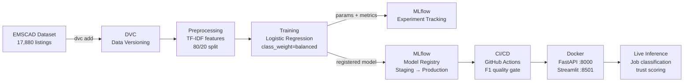

# Fake Job Detector

ML-powered fake job listing classifier with full MLOps pipeline.

## Problem

Indian Tier-3 CS students apply to jobs across fragmented platforms. Some listings are scams — fake postings designed to harvest personal data or collect application fees. This model detects fraudulent listings using NLP and is integrated into the FreshR job aggregation platform's trust scoring pipeline.

## Architecture



## Tech Stack

| Component | Tool | Why |
|---|---|---|
| ML Model | scikit-learn (TF-IDF + LogisticRegression) | Trains in seconds, no GPU, interpretable |
| Experiment Tracking | MLflow + SQLite backend | Logs params, metrics, artifacts per run |
| Model Registry | MLflow Model Registry | Staging → Production promotion workflow |
| Data Versioning | DVC + Git LFS | Raw dataset and model artifacts versioned with code |
| API | FastAPI + uvicorn | Async, typed, auto-docs at `/docs` |
| Dashboard | Streamlit | Rapid UI for job verification display |
| Scraping | python-jobspy | Multi-source scraping (LinkedIn + Indeed) |
| CI/CD | GitHub Actions | Lint → test → model quality gate on every PR |
| Containerization | Docker + docker-compose | Reproducible serving across environments |

## Quick Start

```bash
# Clone and install
git clone https://github.com/Saksham-3175/fake-job-detector.git
cd fake-job-detector
pip install -r requirements.txt

# Run the full pipeline
make preprocess   # Clean data + stratified split → data/train.csv, data/test.csv
make train        # Train + log to MLflow + register model → Staging

# Start the app
make serve        # FastAPI on :8000
make ui           # Streamlit dashboard on :8501

# Or run all services via Docker
make docker       # API :8000 + Dashboard :8501 + MLflow UI :5000
```

## MLOps Pipeline

**1. Data Versioning (DVC)**
Raw dataset and model artifacts are tracked via DVC with Git LFS as the storage backend. Reproduce the full pipeline from raw data:
```bash
dvc repro        # runs preprocess → train in dependency order
dvc status       # check which stages are stale
```

**2. Experiment Tracking (MLflow)**
Every training run logs hyperparameters (C, max_features, ngram_range), metrics (accuracy, precision/recall/F1 per class), and artifacts (model, confusion matrix) to a local SQLite database.
```bash
mlflow ui        # open at http://localhost:5000
```

**3. Model Registry**
The best model is registered in MLflow's Model Registry and automatically transitioned to Staging after each training run. Promote to Production when ready:
```bash
make train       # trains → registers → Staging
make promote     # Staging → Production
```

**4. CI/CD (GitHub Actions)**
On every pull request to `development`, the pipeline runs:
- `lint` — ruff check across the codebase
- `test` — pytest suite with schema and data validation tests
- `model-quality-gate` — trains fresh, asserts recall_fake ≥ 0.70 and F1_fake ≥ 0.60. Blocks merge on failure.

**5. Containerized Serving**
All services run in isolated containers via docker-compose. The API loads the model at startup; Streamlit calls the API internally via the `api` service hostname.
```bash
docker-compose up --build
```

## Model Performance

Trained on the [EMSCAD dataset](https://www.kaggle.com/datasets/shivamb/real-or-fake-fake-jobposting-prediction) — 17,880 job listings, 4.8% fraudulent.

| Metric | Score |
|---|---|
| Accuracy | 98.8% |
| Precision (Fake) | 83.6% |
| Recall (Fake) | 94.2% |
| F1 (Fake) | 88.6% |

> We optimize for **Recall on fake listings** — missing a scam causes real harm. A false positive (flagging a real job as suspicious) is a minor inconvenience.

## Project Structure

```
fake-job-detector/
├── .github/workflows/ci.yml   # CI: lint + test + model quality gate
├── data/
│   ├── fake_job_postings.csv  # Raw dataset (Git LFS)
│   ├── train.csv              # Generated by preprocess.py
│   └── test.csv               # Generated by preprocess.py
├── ml/
│   ├── preprocess.py          # Data cleaning + stratified split
│   ├── train.py               # Training + MLflow logging + model registry
│   └── predict.py             # Inference module
├── scraper/
│   └── job_scraper.py         # JobSpy multi-query scraper
├── api/
│   └── main.py                # FastAPI server
├── ui/
│   └── app.py                 # Streamlit dashboard
├── models/
│   ├── fake_job_model.joblib  # Trained model (Git LFS)
│   └── confusion_matrix.png   # Logged to MLflow (Git LFS)
├── tests/
│   ├── test_predict.py        # Prediction schema + edge cases
│   └── test_preprocess.py     # Data pipeline validation
├── dvc.yaml                   # DVC pipeline stages
├── Makefile                   # One-command workflows
├── Dockerfile                 # FastAPI + model serving
├── docker-compose.yml         # API + Streamlit + MLflow UI
└── requirements.txt
```

## Future Scope

- Integration with FreshR platform for real-time trust scoring on live job aggregation
- DistilBERT fine-tuning as dataset grows beyond the current EMSCAD baseline
- Prometheus + Grafana monitoring for prediction drift detection
- A/B testing framework for comparing model versions in production

## License

MIT
